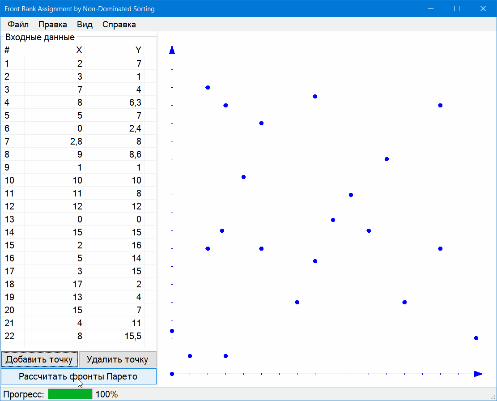

# Front Rank Assignment by Non-Dominated Sorting

## Formulation of the problem
### Algorithm 101
Let’s say you have two candidate buildings, M and N. M is said to Pareto dominate N if M is at least as good as N in all objectives, and superior to N in at least one objective. If this were the case, why would you ever pick N instead of M? M is at least as good everywhere and better in something.
Neither M nor N dominates the other if they’re identical in all objectives, or if N is better in some things but M is better in other things. In those cases, both M and N are of interest to our building engineer. So, another way of saying the “best options” is the set of buildings which are dominated by no other building. We say that these buildings are nondominated. This set of buildings is the Pareto nondominated front (or just “Pareto front”) of the space of solutions.
A lot of current algorithms instead use notions of Pareto domination to get a little more closely at what “better” means in a multiobjective sense. One simple way to do this is to construct a tournament selection operator based on Pareto domination. But first, let’s review the definition. Individual A Pareto dominates individual B if A is at least as good as B in every objective and better than B in at least one objective.
We start here with a new concept called a Pareto Front Rank. Individuals in the Pareto front are in Rank 1. If we removed these individuals from the population, then computed a new front, individuals in that front would be in Rank 2. If we removed those individuals, then computed a new front, we’d get Rank 3, and so on. It’s like peeling an onion.

## Algorithm description
Let’s start by defining how to compute a Pareto front. The trick is to go through the population and add an individual to the front if it isn’t dominated by anyone presently in the front, and remove individuals from the front if they got dominated by this new individual. It’s fairly straightforward.
Computing the ranks is easy: figure out the first front, then remove the individuals, then figure out the front again, and so on.
The algorithm to compute the ranks builds two results at once: first it partitions the population P into ranks, with each rank (a group of individuals) stored in the vector F. Second, it assigns a rank number to an individual (perhaps the individual gets it written internally somewhere). That way later on we can ask both: (1) which individuals are in rank i, and (2) what rank is individual j in? This procedure is called Non-Dominated Sorting, by N. Srinvas and Kalyanmoy Deb.

## Demonstration

## Bibliography
1. Эрих Гамма, Ричард Хелм, Ральф Джонсон, Джон Влиссидес – Приёмы объектно-ориентированного проектирования. Паттерны проектирования, 1994
2. Charles Petzold – Programming Microsoft Windows with C#, 2002
3. Sean Luke – Essentials of Metaheuristics, 2015
